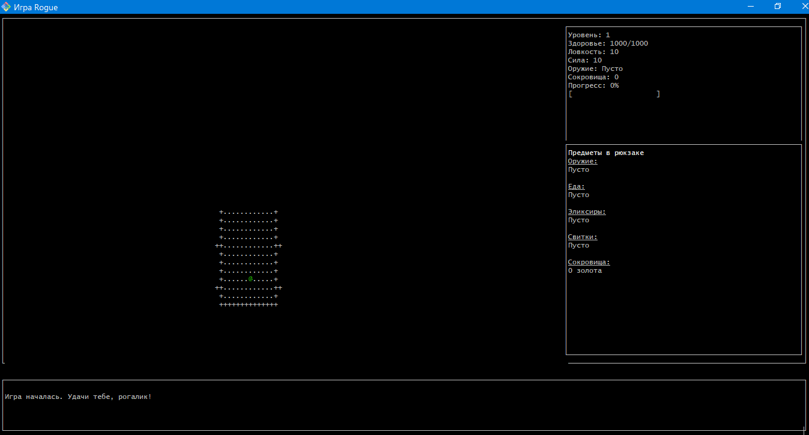
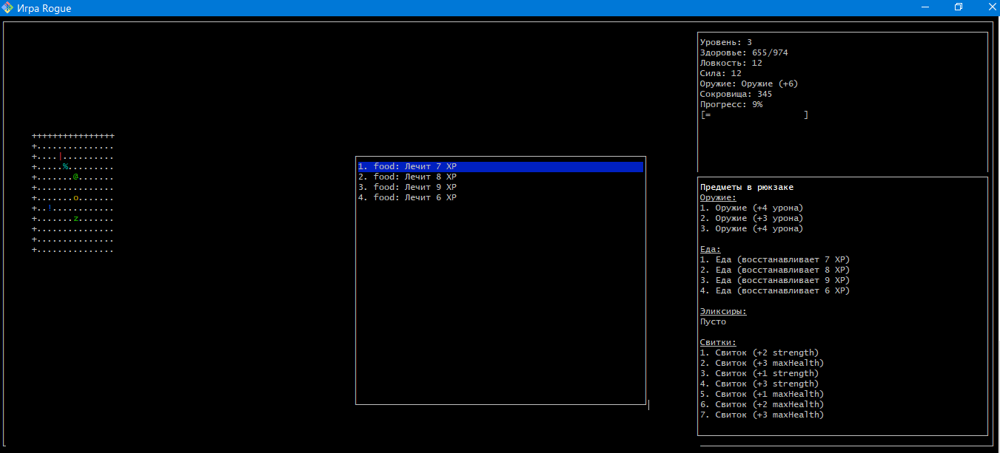
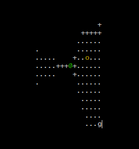
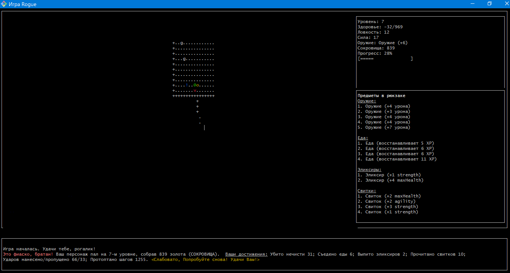
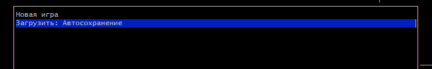

# rogue-game (рогалик)
Описание: 
Данный проект представляет собой консольное игровое roguelike-приложение на языке javaScript с использованием библиотеки curses (в версии blessed для js) в духе классическоей игры Rogue 1980 года разработки. 
Игра начинается на самом верхнем ярусе не нанесенного на карту подземелья с большим количеством монстров и сокровищ. Постепенно по мере продвижения вглубь случайно сгенерированного подземелья, возрастает сила монстров и продвижение усложняется. 
Архитектура приложения:
  - слой доступа к данным datalayer; 
  - слой бизнес-логики domain; 
  - слой представления presentation. 

datalayer отвечает за сохранение и загрузку последней игры. domain определяет логики сущностей (игровая сессия, персонаж, противник, уровень, комната, коридор, рюкзак, предмет), а также логики игрового процесса. presentation организовывает логики отображения на экране пользователя и ввод пользовательских данных. 
Логика игры: 
Игра содержит 21 уровень с подземельями. Каждый уровень подземелья состоит из 9 комнат, соединенных коридорами, из любой комнаты по этим коридорам можно попасть в любую другую. В каждой комнате, за исключением стартовой, находятся противники и полезные предметы. Цель игры - найти на каждом уровне переход на следующий уровень и так пройти 21 уровень. С каждым новым уровнем повышается количество и сложность противников, снижается количество полезных предметов и повышается количество сокровищ, которые выпадают с побежденных противников. Игра работает в пошаговом режиме (пока игрок не сделал ход, весь мир стоит в ожидании). 
Логика персонажа: 
Персонаж @ имеет характеристики текущего и максимального уровня здоровья, ловкости (вероятности попадания по противникам и уклонения от их ударов), силы (базовый урон без оружия). За победу над противником персонаж получает сокровища в зависимости от сложности противника. Персонаж может поднимать полезные предметы и складывать их в свой рюкзак, а затем использовать их. Каждый предмет при использовании временно или постоянно увеличивает одну из характеристик персонажа. 
Логика противников: 
Каждый противник имеет аналогичные персонажу характеристики, но дополнительно обладают враждебностью (определяет расстояние, с которого противник начинает преследовать персонажа). В игре представлено 5 видов противников. Зомби z, Вампир v, Привидение g, Огр o, Змей-Маг s. Первый удар по вампиру - всегда промах. Приведение постоянно телепортируется по комнате и периодически становится невидимым. Огр после каждой атаки отдыхает один ход, а затем гарантированно атакует. Змей-Маг ходит по карте по диагонали, постоянно меняя сторону, при каждой своей успешной атаке может усыпить персонажа на 1 ход. Когда начинается преследование персонажа, все монстры двигаются по одному паттерну (кратчайшим путем по соседним клеткам в сторону игрока). 
Логика окружения: 
В игре 5 типов предметов. Сокровища влияют на итоговый рейтинг, еда восстанавливает здоровье, эликсиры временно повышают одну из характеристик персонажа, свитки делают тоже самое, но только на постоянной основе, оружие увеличивает наносимый урон противнику. Собранные предметы хранятся в рюкзаке персонажа, но не более 9 штук для каждого наименования. 
Логика боя: 
Атака производится путем перемещения персонажа по направлению к противнику. Удар проверяется на попадание исходя из ловкости атакующего и защищающегося, урон рассчитывается комбинацией сила плюс оружие персонажа. 
При нахождении персонажа в непосредственной близости с комнатой со стороны коридора туман войны рассеивается только на области прямой видимости. Для определения видимой области используется алгоритм Брезенхэма. 
Управление персонажем осуществляется клавишами клавиатуры wasd, применение предметов из рюкзака h,j,k,e.
При завершении игры (победа или поражение) выводится подробная статистка прохождения игроком игры (количество поверженных противников, количество использованных предметов ...). 
ВНИМАНИЕ: для запуска игры после скачивания папок и файлов из репозитория, необходимо установить библиотеку blessed в текущее приложение командой npm istall blessed. После этого командой node main.js запустить игру. Игру желательно запускать в git Bash, если запускать через терминал VS code может быть неполное отображение окон игры. Выход из игры клавиша ESC. 
**Начало игры:** 
 
**Использование предметов из рюкзака:** 
 
**Туман войны:** 
 
**Финальная статистика прохождения игры:** 
 
**Загрузка ранее сохраненной игры:** 
 